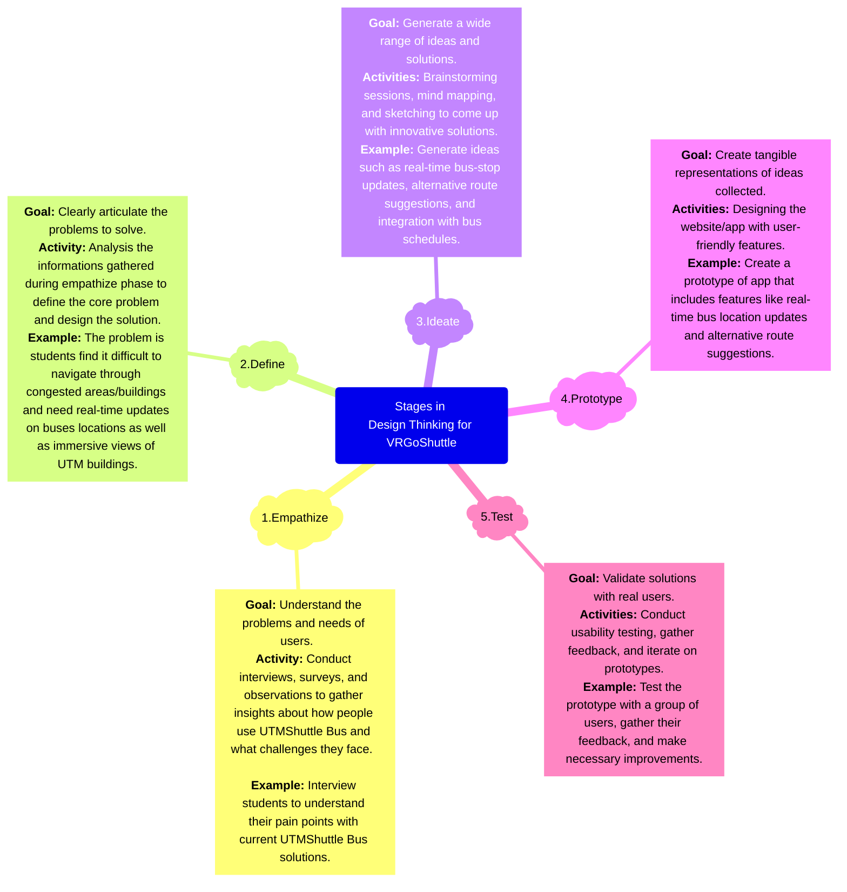

```mermaid
mindmap
  root(Stages in 
Design Thinking for VRGoShuttle)
    )1.Empathize(
      [**Goal:** Understand the problems and needs of users.     
**Activity:** Conduct interviews, surveys, and observations to gather insights about how people use UTMShuttle Bus and what challenges they face.        
**Example:** Interview students to understand their pain points with current UTMShuttle Bus solutions.]
    )2.Define(
      [**Goal:** Clearly articulate the problems to solve.
      **Activity:** Analysis the informations gathered during empathize phase to define the core problem and design the solution.
      **Example:** The problem is students find it difficult to navigate through congested areas/buildings and need real-time updates on buses locations as well as immersive views of UTM buildings.]
    )3.Ideate(
      [**Goal:** Generate a wide range of ideas and solutions.
**Activities:** Brainstorming sessions, mind mapping, and sketching to come up with innovative solutions.
**Example:** Generate ideas such as real-time bus-stop updates, alternative route suggestions, and integration with bus schedules.]
    )4.Prototype(
      [**Goal:** Create tangible representations of ideas collected.
      **Activities:** Designing the website/app with user-friendly features.
      **Example:** Create a prototype of app that includes features like real-time bus location updates and alternative route suggestions.]
    )5.Test(
      [**Goal:** Validate solutions with real users.
      **Activities:** Conduct usability testing, gather feedback, and iterate on prototypes.
      **Example:** Test the prototype with a group of users, gather their feedback, and make necessary improvements.]
```

