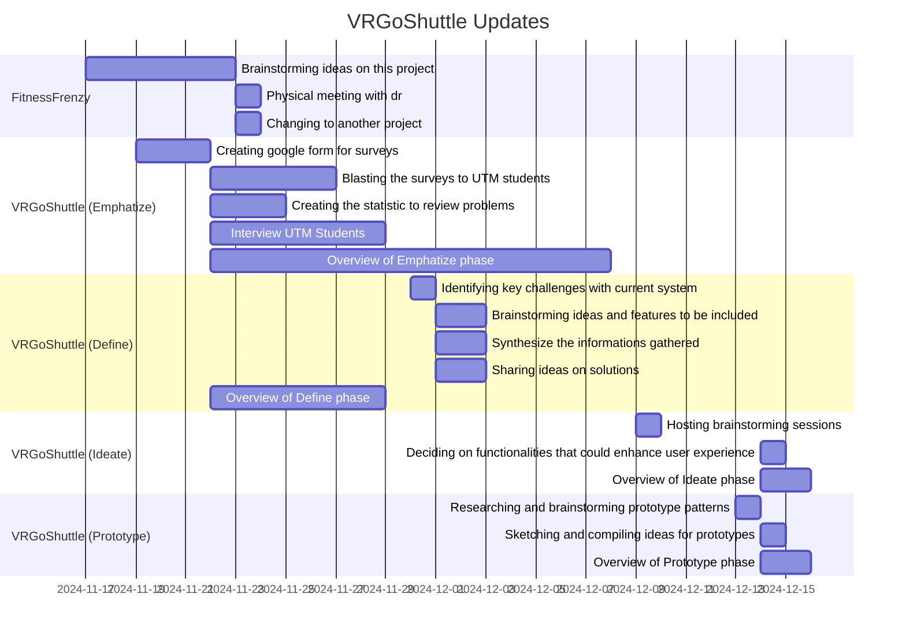

```mermaid
gantt
    title VRGoShuttle Updates
    dateFormat YYYY-MM-DD
    section FitnessFrenzy 
        Brainstorming ideas on this project :a1, 2024-11-17, 6d
        Physical meeting with dr    :after a1, 1d
        Changing to another project :after a1, 1d
    section VRGoShuttle (Emphatize)
        Creating google form for surveys    :b1, 2024-11-19, 3d
        Blasting the surveys to UTM students   :after b1, 5d
        Creating the statistic to review problems :after b1, 3d
        Interview UTM Students :after b1, 7d
        Overview of Emphatize phase    :after b1, 16d
   section VRGoShuttle (Define)
        Identifying key challenges with current system:c1, 2024-11-30, 1d
        Brainstorming ideas and features to be included :after c1, 2d
        Synthesize the informations gathered    :after c1, 2d
        Sharing ideas on solutions   :after c1, 2d
        Overview of Define phase    :after b1, 7d
section VRGoShuttle (Ideate)
        Hosting brainstorming sessions :d1, 2024-12-9, 1d
        Deciding on functionalities that could enhance user experience :after d1, 1d
        Overview of Ideate phase    :after d1, 2d
section VRGoShuttle (Prototype)
        Researching and brainstorming prototype patterns :d1, 2024-12-13, 1d
        Sketching and compiling ideas for prototypes :after d1, 1d
        Overview of Prototype phase    :after d1, 2d

```
